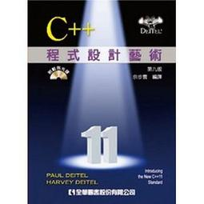

C++程式設計藝術
====================

譯者: 余步雲

章節目錄：
--------------------------

* [第 2 章：練習之程式](02-Chapter)
* [第 3 章：練習之程式](03-Chapter)
* [第 4 章：練習之程式](04-Chapter)
* [第 5 章：練習之程式](05-Chapter)
* [第 6 章：練習之程式](06-Chapter)
* [第 7 章：練習之程式](07-Chapter)
* [第 8 章：練習之程式](08-Chapter)
* [第 9 章：練習之程式](09-Chapter)
* [第 10 章：練習之程式](10-Chapter)
* [第 11 章：練習之程式](11-Chapter)
* [第 12 章：練習之程式](12-Chapter)
* [第 13 章：練習之程式](13-Chapter)
* [第 14 章：練習之程式](14-Chapter)
* [第 15 章：練習之程式(未練習)](15-Chapter)
* [第 16 章：練習之程式(未練習](16-Chapter)
* [第 17 章：練習之程式(未練習](17-Chapter)
* [第 18 章：練習之程式(未練習](18-Chapter)
* [第 19 章：練習之程式(未練習](19-Chapter)
* [第 20 章：練習之程式(未練習](20-Chapter)
* [第 21 章：練習之程式(未練習](21-Chapter)
* [第 22 章：練習之程式(未練習](22-Chapter)
* [第 23 章：練習之程式(未練習](23-Chapter)
* [第 24 章：練習之程式(未練習](24-Chapter)
* [第 25 章：練習之程式(未練習](25-Chapter)
* [第 26 章：練習之程式(未練習](26-Chapter)
* [為了搞懂邏輯測試用Code](搞懂邏輯之Code)