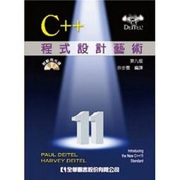

C++程式設計藝術
====================

譯者: 余步雲

 範例程式：
--------------------------

* [第 1 章：範例之程式](ch01)
* [第 2 章：範例之程式](ch02)
* [第 3 章：範例之程式](ch03)
* [第 4 章：範例之程式](ch04)
* [第 5 章：範例之程式](ch05)
* [第 6 章：範例之程式](ch06)
* [第 7 章：範例之程式](ch07)
* [第 8 章：範例之程式](ch08)
* [第 9 章：範例之程式](ch09)
* [第 10 章：範例之程式](ch10)
* [第 11 章：範例之程式](ch11)
* [第 12 章：範例之程式](ch12)
* [第 13 章：範例之程式](ch13)
* [第 14 章：範例之程式](ch14)
* [第 15 章：範例之程式](ch15)
* [第 16 章：範例之程式](ch16)
* [第 17 章：範例之程式](ch17)
* [第 18 章：範例之程式](ch18)
* [第 19 章：範例之程式](ch19)
* [第 20 章：範例之程式](ch20)
* [第 21 章：範例之程式](ch21)
* [第 22 章：範例之程式](ch22)
* [第 23 章：範例之程式](ch23)
* [第 24 章：範例之程式](ch24)
* [第 25 章：範例之程式](ch25)
* [第 26 章：範例之程式](ch26)

* [附件：F](appF)
* [附件：H](appH)
* [附件：I](appI)
* [附件：J](appJ)